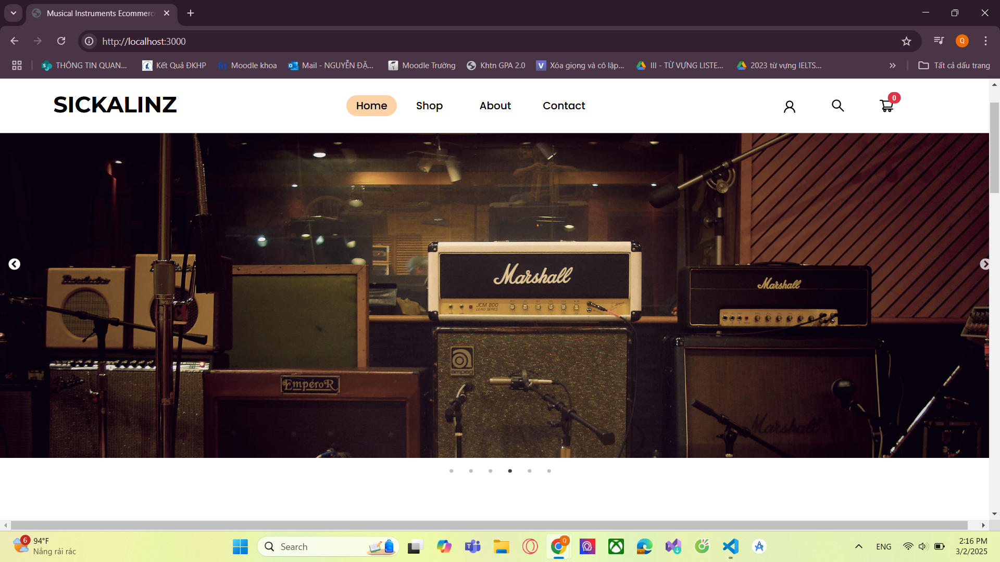
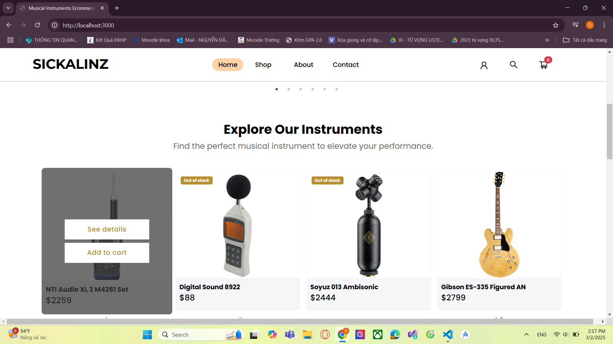
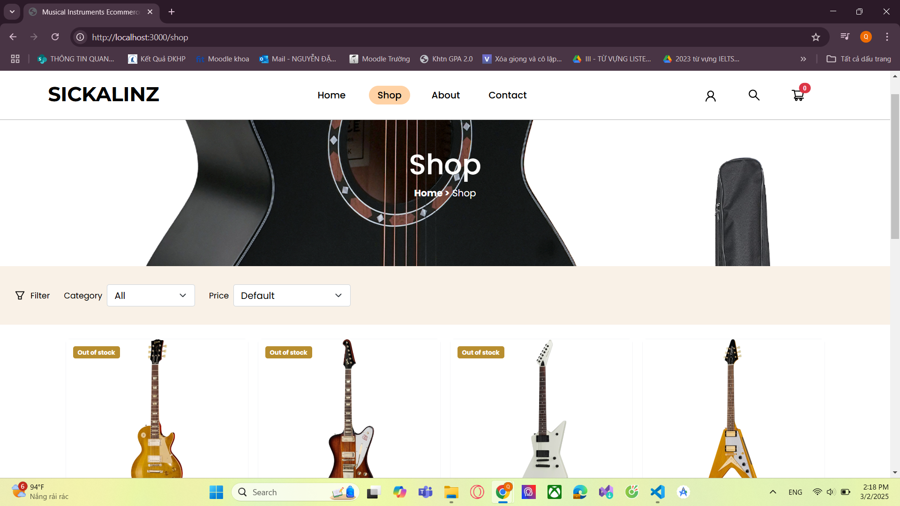
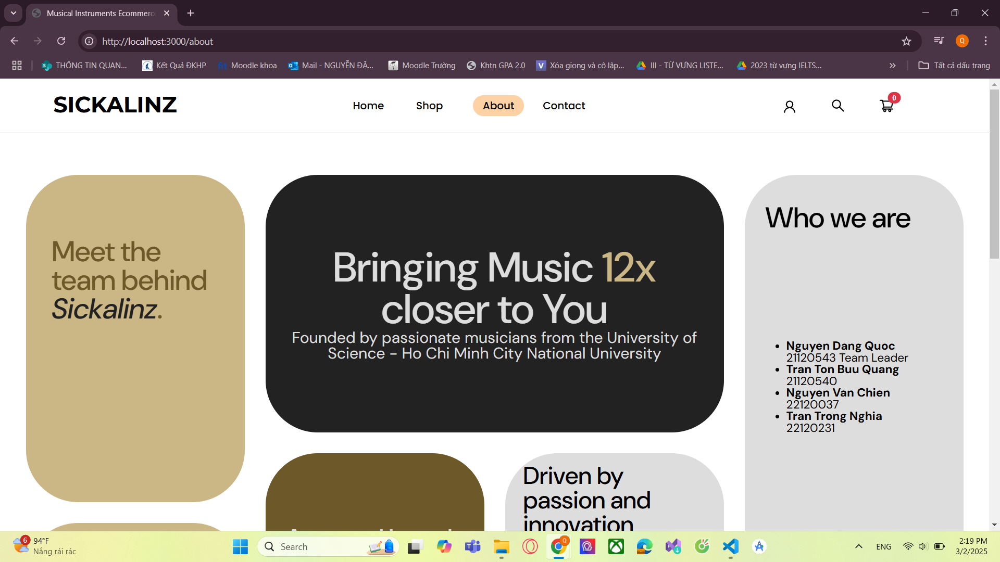
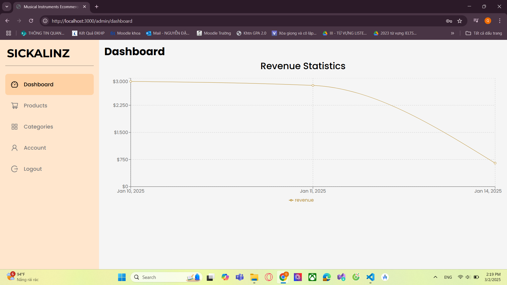
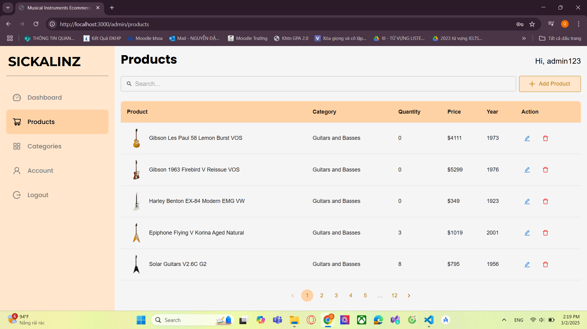

# Musical Instrument Store
## 🚀 Project Overview
Musical Instrument Store là một ứng dụng web bán nhạc cụ trực tuyến, sử dụng:

Frontend: React.js
Backend: Express.js
Database: PostgreSQL
Kiến trúc: MVC
API giao tiếp: AJAX
## 🛠️ Phần 1: Git Workflow
1. Branching Strategy
Chúng ta sử dụng chiến lược Feature Branch Workflow:

- Nhánh chính:
main: Chỉ chứa code đã kiểm thử, sẵn sàng cho sản xuất.

- Nhánh theo giai đoạn:
milestone1: Chứa code ổn định đã được tích hợp trong giai đoạn 1
milestone2: Chứa code ổn định đã được tích hợp trong giai đoạn 2

- Nhánh Dev:
Từng thành viên code và push lên nhánh của mình

2. Commit Guidelines
Commit message phải rõ ràng, theo định dạng

## 🏗️ Phần 2: Coding Workflow
1. Project Structure
Dự án được tổ chức theo mô hình MVC như sau:
- Model được lưu trong thư mục backend/src/models
- View được lưu trữ trong thư mục frontend
- Controller được lưu trữ trong  thư mực backend/src/controllers

2. Coding Standards
- Quy tắc đặt tên:
Component: Sử dụng PascalCase (Navbar, ProductCard).
Biến và hàm: Sử dụng camelCase (handleClick, fetchData).

- Component Organization
Client components: Đặt trong components/Client
Admin components: Đặt trong components/Admin

- Page Organization
Client pages: Đặt trong pages/Client
Admin pages: Đặt trong pages/Admin

## 💻 Phần 3: Preview

